<!DOCTYPE html>
<html lang="id">
<head>
    <meta charset="UTF-8" />
    <meta name="viewport" content="width=device-width, initial-scale=1.0" />
    <title>🧱 MEDIKOM SMAN 2 JAKARTA · Retro Edition</title>

    <!-- Font & Icons -->
    <link rel="preconnect" href="https://fonts.googleapis.com" />
    <link rel="preconnect" href="https://fonts.gstatic.com" crossorigin />
    <link
    href="https://fonts.googleapis.com/css2?family=Press+Start+2P&family=Quicksand:wght@400;600;700&display=swap"
    rel="stylesheet" />
    <link rel="stylesheet" href="https://cdnjs.cloudflare.com/ajax/libs/font-awesome/6.0.0-beta3/css/all.min.css" />
    <!-- Bootstrap 5 untuk carousel & grid -->
    <link href="https://cdn.jsdelivr.net/npm/bootstrap@5.3.8/dist/css/bootstrap.min.css" rel="stylesheet"
    integrity="sha384-sRIl4kxILFvY47J16cr9ZwB07vP4J8+LH7qKQnuqkuIAvNWLzeN8tE5YBujZqJLB" crossorigin="anonymous">

    
</head>
<body>

    <!-- ===== BACKGROUND ===== -->
    

    <!-- ==================== HALAMAN 1 ==================== -->
    

        

            <!-- ===== HERO ===== -->
            <header class="hero">
                

                    <i class="fas fa-crown"></i> MEDIKOM · SMAN 2 JAKARTA
                

                
                <h1 class="glow-title">
                    MEDIKOM 
                    SMAN 2 JAKARTA
                </h1>
                

                    <i class="fas fa-bolt"></i> SUB-ORGANISASI MEDIA INFORMASI & KOMUNIKASI · 2026 <i class="fas fa-bolt"></i>
                

            </header>

            <!-- ===== NAVIGASI RETRO ===== -->
            

                <a href="#tentang">📖 Tentang</a>
                <a href="#profil">👤 Profil</a>
                <a href="#fasilitas">🛠️ Fasilitas</a>
                <a href="#divisi">📂 Divisi</a>
                <a href="#prestasi">🏆 Prestasi</a>
                <a href="#galeri">📸 Galeri</a>
                <a href="#video">🎬 Video</a>
                <a href="#kontak">📞 Kontak</a>
                <a href="#daftar" class="nav-daftar">📝 Daftar</a>
            

            <!-- ===== TOMBOL "KLIK DI SINI" => pindah ke halaman2 ===== -->
            

                <button class="btn-klik" id="btnToPage2">
                    <i class="fas fa-rocket"></i> KLIK DI SINI
                </button>
            

            <!-- ===== VISUAL EFFECTS ===== -->
            <h2 class="section-title">
                <i class="fas fa-eye"></i> VISUAL EFFECTS <i class="fas fa-star"></i>
            </h2>

            

                <canvas id="effectCanvas"></canvas>
                

                    <i class="fas fa-bolt"></i>
                    MEDIKOM · RETRO WAVES
                    <i class="fas fa-bolt"></i>
                

            

            <!-- ===== MARQUEE ===== -->
            

                

                    ✦ MEDIKOM SMAN 2 JAKARTA ✦ SUB-ORGANISASI MEDIA INFORMASI & KOMUNIKASI ✦ THE SOUND OF SMAN 2 JAKARTA ✦
                    ✦ MEDIKOM SMAN 2 JAKARTA ✦ SUB-ORGANISASI MEDIA INFORMASI & KOMUNIKASI ✦ THE SOUND OF SMAN 2 JAKARTA ✦
                

            

            <!-- ===== TENTANG KAMI ===== -->
            <section id="tentang">
                

                    📖 TENTANG KAMI
                

                <h2 class="section-title">
                    <i class="fas fa-info-circle"></i> Apa itu MEDIKOM? <i class="fas fa-info-circle"></i>
                </h2>
                

                    

                        <strong style="color:#ffe74a;">MEDIKOM SMAN 2 JAKARTA</strong> adalah sebuah Sub-Organisasi yang
                        memadukan nilai-nilai organisasi dengan teknologi modern untuk mengembangkan kreativitas, wawasan,
                        serta minat dan bakat siswa/i di bidang media, komunikasi, dan teknologi digital.
                    

                

            </section>

            <!-- ===== PROFIL ===== -->
            <section id="profil">
                

                    👤 PROFIL
                

                <h2 class="section-title">
                    <i class="fas fa-user"></i> Pembina & Ketua <i class="fas fa-user"></i>
                </h2>
                

                    

                        

                            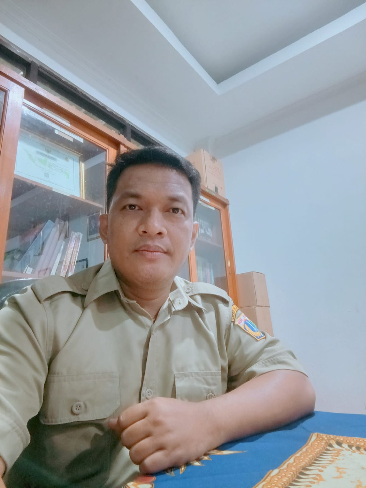
                            

                                PEMBINA
                                <h4>Bpk. Dwi Chandra Kusworo</h4>
                                
Dedikasi tinggi dalam membangun pendidikan berkualitas, berkarakter, serta berorientasi pada perkembangan teknologi dan kreativitas siswa.

                            

                        

                    

                    

                        

                            
                            

                                KETUA
                                <h4>Calysta Aurellia</h4>
                                
Berperan aktif dalam mendukung pengelolaan Sub-Organisasi, meningkatkan kualitas program, serta mendorong prestasi dan karakter siswa.

                            

                        

                    

                

            </section>

            <!-- ===== FASILITAS ===== -->
            <section id="fasilitas">
                

                    🛠️ FASILITAS
                

                <h2 class="section-title">
                    <i class="fas fa-tools"></i> Fasilitas Dan Merchandise <i class="fas fa-tools"></i>
                </h2>
                

                    <!-- Diisi oleh JS -->
                

            </section>

            <!-- ===== DIVISI MEDIKOM ===== -->
            <section id="divisi">
                

                    📂 DIVISI KAMI
                

                <h2 class="section-title">
                    <i class="fas fa-users"></i> 5 Divisi Unggulan MEDIKOM <i class="fas fa-users"></i>
                </h2>
                

                    <!-- Divisi 1: Fotografi -->
                    

                        

                        
Divisi Fotografi

                        
📸 Foto

                        
"Mengabadikan momen terbaik dengan teknik fotografi profesional."

                        <button class="btn btn-sm btn-klik" style="font-size:0.6rem; padding:4px 12px; margin-top:8px;" data-bs-toggle="modal" data-bs-target="#imageOnlyModal" data-image="POSTER DIVISI FOTOGRAFI (1).png">LIHAT KARTU</button>
                    

                    <!-- Divisi 2: Sinematografi -->
                    

                        

                        
Divisi Sinematografi

                        
🎬 Cinema

                        
"Menghasilkan karya film pendek dan sinematik berkualitas tinggi."

                        <button class="btn btn-sm btn-klik" style="font-size:0.6rem; padding:4px 12px; margin-top:8px;" data-bs-toggle="modal" data-bs-target="#imageOnlyModal" data-image="POSTER DIVISI SINEMATOGRAFI  - Copy.png">LIHAT KARTU</button>
                    

                    <!-- Divisi 3: Radio -->
                    

                        

                        
Divisi Radio

                        
📻 Penyiaran

                        
"Mengelola program siaran radio sekolah yang informatif dan menghibur."

                        <button class="btn btn-sm btn-klik" style="font-size:0.6rem; padding:4px 12px; margin-top:8px;" data-bs-toggle="modal" data-bs-target="#imageOnlyModal" data-image="POSTER DIVISI RADIO (1).png">LIHAT KARTU</button>
                    

                    <!-- Divisi 4: Mading & Desain -->
                    

                        

                        
Divisi Mading & Desain

                        
📰 Kreativitas Visual

                        
"Merancang mading sekolah dan materi desain grafis yang menarik."

                        <button class="btn btn-sm btn-klik" style="font-size:0.6rem; padding:4px 12px; margin-top:8px;" data-bs-toggle="modal" data-bs-target="#imageOnlyModal" data-image="POSTER DIVISI MADES (1).png">LIHAT KARTU</button>
                    

                    <!-- Divisi 5: Jurnalistik -->
                    

                        

                        
Divisi Jurnalistik

                        
📰 Liputan & Berita

                        
"Menyajikan informasi aktual dan terpercaya seputar kegiatan sekolah."

                        <button class="btn btn-sm btn-klik" style="font-size:0.6rem; padding:4px 12px; margin-top:8px;" data-bs-toggle="modal" data-bs-target="#imageOnlyModal" data-image="POSTER DIVISI JURNALISTIK.png">LIHAT KARTU</button>
                    

                

            </section>

            <!-- ===== PRESTASI (HANYA SATU) ===== -->
            <section id="prestasi">
                

                    🏆 PRESTASI
                

                <h2 class="section-title">
                    <i class="fas fa-trophy"></i> Prestasi Terbaru <i class="fas fa-trophy"></i>
                </h2>
                

                    <!-- Hanya satu prestasi tersisa -->
                    

                        
<i class="fas fa-medal"></i>

                        <h5>Pemenang Ide Cerita Film Pendek – Jakarta Youth Film Fund For Student 2026</h5>
                        
Penghargaan tingkat nasional dalam bidang ide cerita pembuatan film pendek yang akan dibuat film pendek dan akan didanai oleh Jakarta Youth Film Fund For Student 2026

                        <button class="btn-lihat-sertifikat" data-bs-toggle="modal" data-bs-target="#imageOnlyModal" data-image="WhatsApp Image 2026-07-06 at 09.24.27.jpeg">📜 Lihat lebih lanjut</button>
                    

                    

                        
<i class="fas fa-medal"></i>

                        <h5>Juara 1 – LENSA KOMPETISI PELAJAR JAKARTA YOUTH FILM FESTIVAL 2026</h5>
                        
Penghargaan tingkat nasional dalam bidang pembuatan film pendek yang diselenggarakan oleh LENSA KOMPETISI PELAJAR JAKARTA YOUTH FILM FESTIVAL 2026

                        <button class="btn-lihat-sertifikat" data-bs-toggle="modal" data-bs-target="#imageOnlyModal" data-image="WhatsApp Image 2026-07-06 .jpeg">📜 Lihat lebih lanjut</button>
                    

                

            </section>

            <!-- ===== GALERI (CAROUSEL) ===== -->
            <section id="galeri">
                

                    📸 GALERI
                

                <h2 class="section-title">
                    <i class="fas fa-images"></i> Foto Kegiatan Kami <i class="fas fa-images"></i>
                </h2>
                

                    

                        

                            

                                

                                    
                                

                                

                                    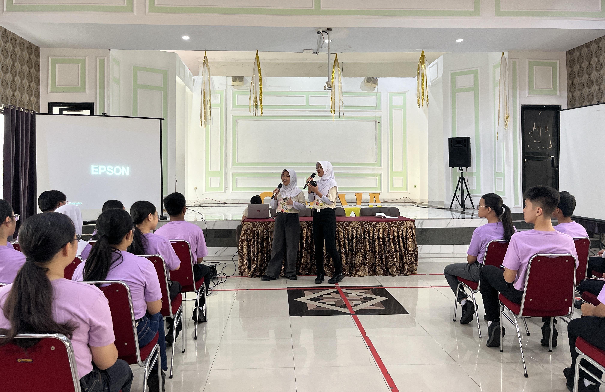
                                

                                

                                    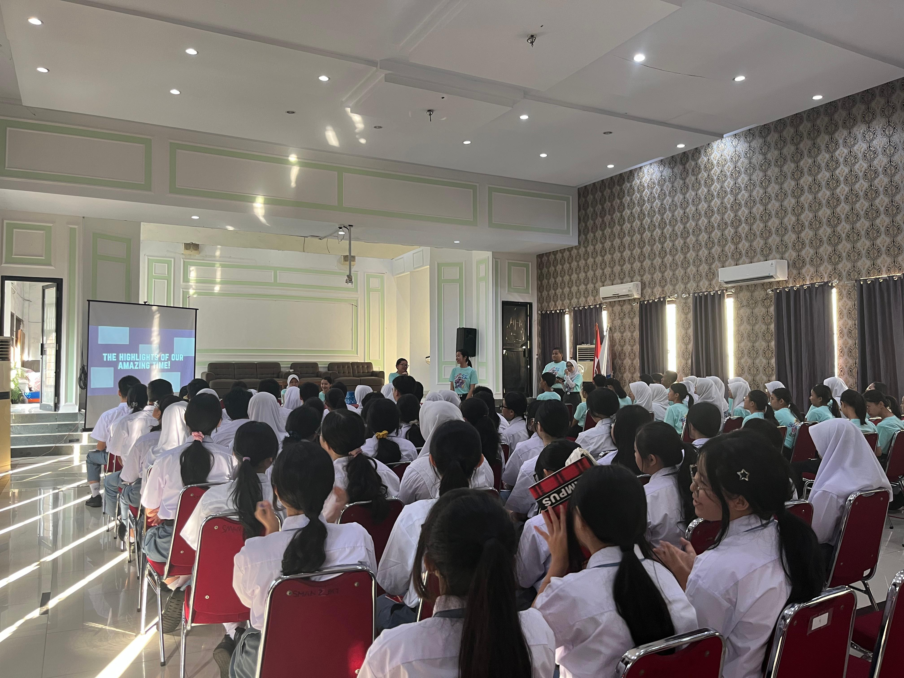
                                

                                

                                    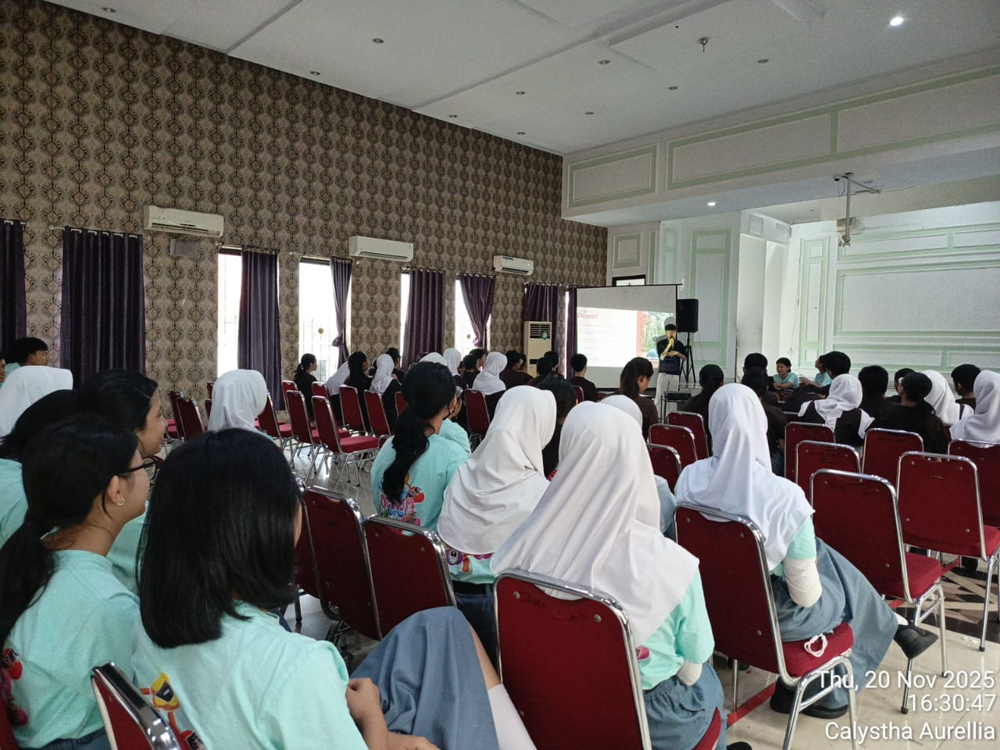
                                

                                

                                    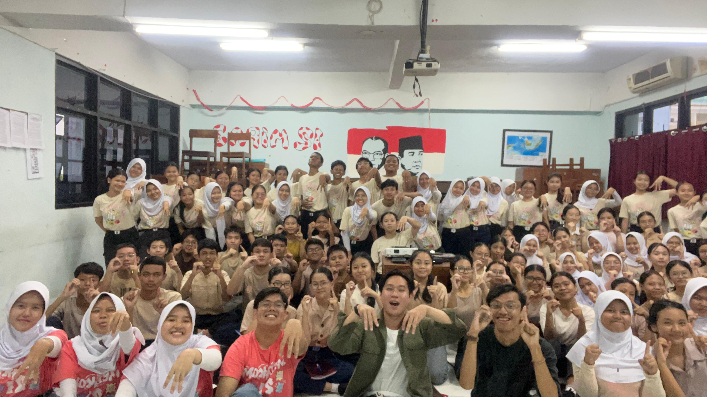
                                

                                

                                    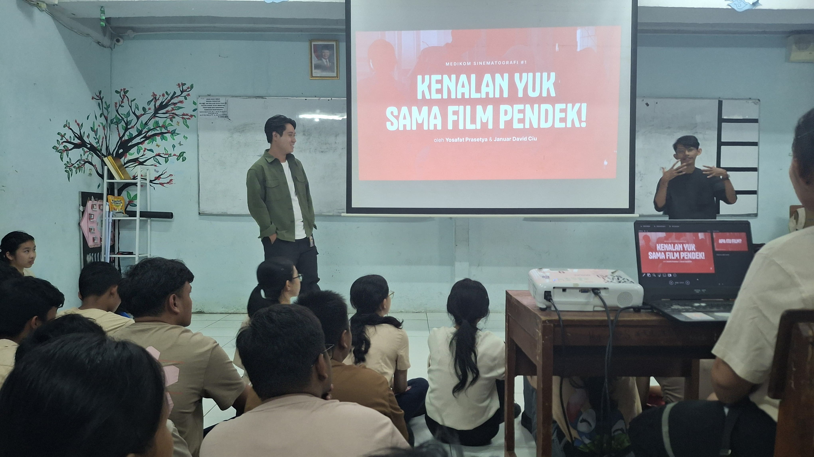
                                

                                

                                    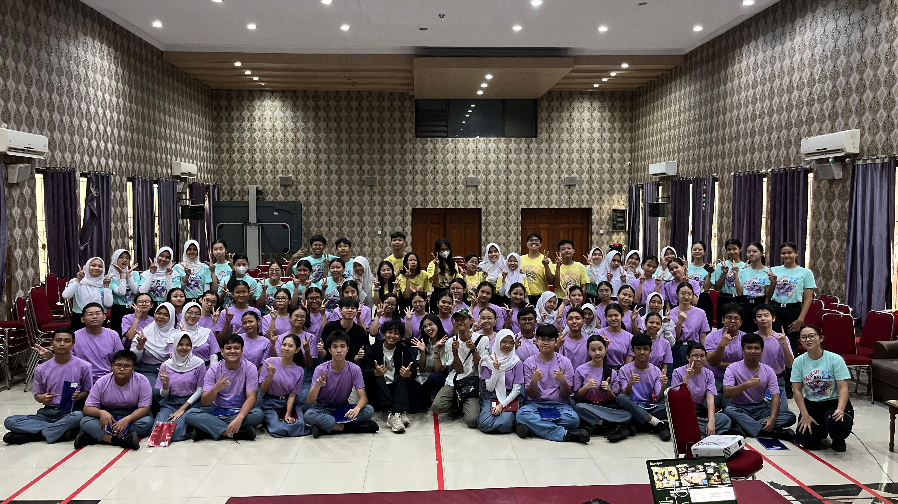
                                

                                

                                    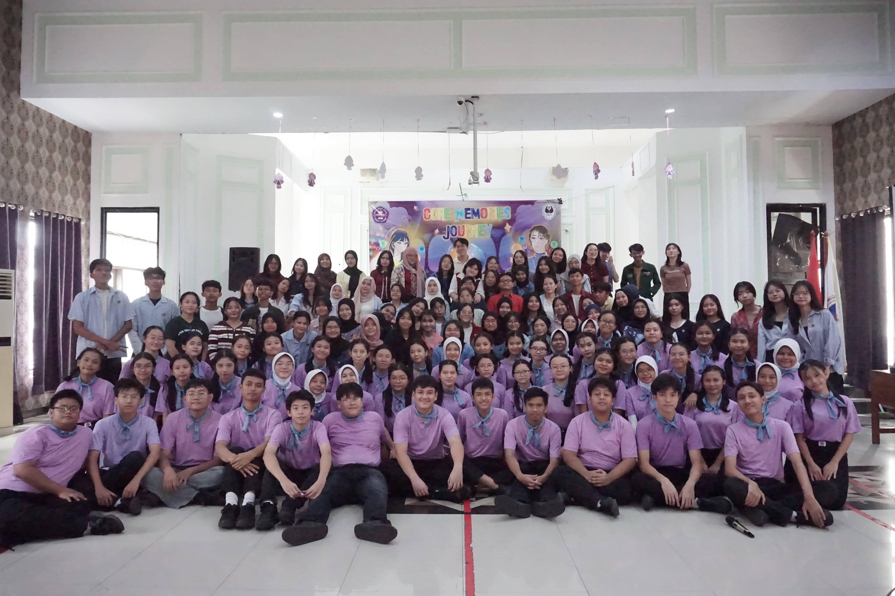
                                

                                

                                    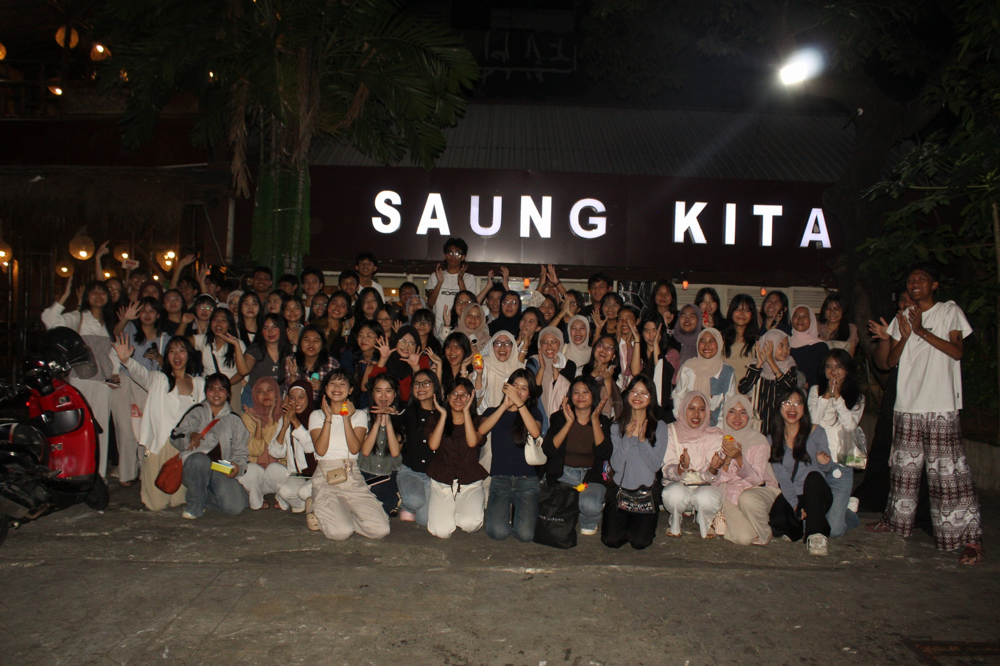
                                

                                

                                    
                                

                                

                                    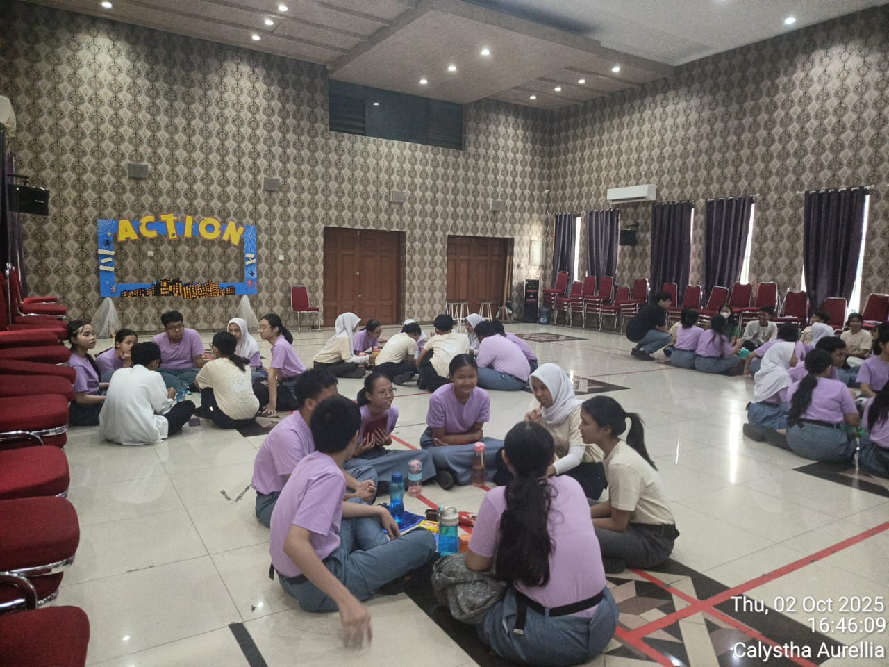
                                

                                

                                    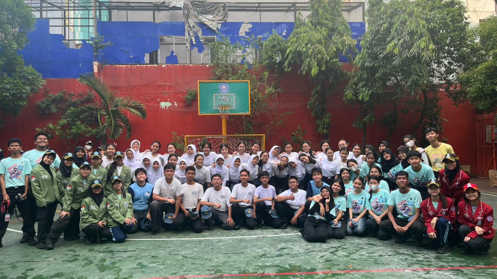
                                

                            

                            <button class="carousel-control-prev" type="button" data-bs-target="#carouselExampleRide" data-bs-slide="prev">
                                
                            </button>
                            <button class="carousel-control-next" type="button" data-bs-target="#carouselExampleRide" data-bs-slide="next">
                                
                            </button>
                        

                    

                

            </section>

            <!-- ===== VIDEO (DUA VIDEO: YOUTUBE & LOKAL) ===== -->
            <section id="video">
                

                    🎬 VIDEO
                

                <h2 class="section-title">
                    <i class="fas fa-play-circle"></i> Video Kami <i class="fas fa-play-circle"></i>
                </h2>
                

                    <!-- Video dari YouTube -->
                    

                        

                            

                                <iframe width="100%" height="100%"
                                src="https://www.youtube.com/embed/KC2GR4jNRHQ?si=oe-OVtgLDOhx3_Sz"
                                title="YouTube video player" frameborder="0"
                                allow="accelerometer; autoplay; clipboard-write; encrypted-media; gyroscope; picture-in-picture; web-share"
                                referrerpolicy="strict-origin-when-cross-origin" allowfullscreen
                                style="position:absolute;top:0;left:0;width:100%;height:100%;"></iframe>
                            

                        

                    

                    <!-- Video dari penyimpanan lokal -->
                    

                        

                            <video controls playsinline>
                                <source src="WhatsApp Video 2026-06-30 at 06.29.54.mp4" type="video/mp4">
                                Browser Anda tidak mendukung pemutaran video. Silakan <a href="WhatsApp Video 2026-06-30 at 06.29.54.mp4">unduh video</a>.
                            </video>
                        

                    

                

            </section>

            <!-- ===== PENDAFTARAN ===== -->
            <section id="daftar">
                

                    📝 PENDAFTARAN
                

                

                    

                        <h2><i class="fas fa-user-plus"></i> AYOO GABUNG MEDIKOM! <i class="fas fa-user-plus"></i></h2>
                        

                            Ingin menjadi bagian dari Sub-Organisasi Media & Teknologi Yang Merupakan Sub-Organisasi terkeren di SMAN 2 Jakarta? 
                            <strong style="color:#00ff88;">Daftarkan dirimu sekarang juga!</strong> 
                           Jika kamu ingin mendapatkan pengalaman, keseruan, pengetahuan dan pertemanan yang luas. "JANGAN LUPA DAFTAR MEDIKOM YAWWW"
                        

                        

                            <i class="fas fa-info-circle"></i> Kamu akan diberikan Google Forms · Pastikan data diisi dengan lengkap dan benar.
                        

                         <h2>JANGAN LUPA GABUNG MEDIKOM YAAA!</i></h2>
                    

                

            </section>

            <!-- ===== KONTAK ===== -->
            <section id="kontak">
                

                    📞 KONTAK
                

                <h2 class="section-title">
                    <i class="fas fa-phone"></i> Hubungi Kami <i class="fas fa-phone"></i>
                </h2>
                

                    Jika ada pertanyaan mengenai informasi tentang MEDIKOM SMAN 2 JAKARTA, silakan hubungi kami melalui kontak berikut.
                

                

                    <a href="https://wa.me/6285694224134" target="_blank" class="contact-card">
                        
💬

                        <h5>WhatsApp</h5>
                        
+62 856-9422-4134

                    </a>
                    <a href="https://instagram.com/medikomsmandu" target="_blank" class="contact-card">
                        
📷

                        <h5>Instagram</h5>
                        
@medikomsmandu

                    </a>
                    <a href="https://youtube.com/@medikomsman2jakarta?si=w1OKeB3u0zkZhBNt" target="_blank" class="contact-card">
                        
📘

                        <h5>Youtube</h5>
                        
@medikomsman2jakarta

                    </a>
                    <a href="https://wa.me/6285709309836" target="_blank" class="contact-card">
                        
💬

                        <h5>WhatsApp</h5>
                        
+62 857-0930-9836

                    </a>
                

            </section>

            <!-- ===== FOOTER ===== -->
            <footer class="footer">
                <i class="fas fa-crown"></i>
                MEDIKOM SMAN 2 JAKARTA · RETRO EDITION
                <i class="fas fa-crown"></i>
                 
                
                    © 2026 <strong>MEDIKOM SMAN 2 JAKARTA</strong>. All Rights Reserved.
                     Designed with Tim MEDIKOM SMAN 2 JAKARTA by Tim Website
                    (Frendy M., Kayzan N. A., Leonardo J. H., Cindy C., dan Raisa W.)
                
            </footer>
        

    

    <!-- ==================== HALAMAN 2 : KARTU DIGITAL ==================== -->
    

        

            
            
MEDIKOM

            
SMAN 2 JAKARTA

            

            

                Kartu Identitas Digital Resmi Sub‑Organisasi Media & Teknologi
            

            

                

                    <i class="fas fa-user"></i>
                    Pembina
                    Bpk. Dwi Chandra K.
                

                

                    <i class="fas fa-crown"></i>
                    Ketua
                    Calysta Aurellia
                

                

                    <i class="fas fa-map-marker-alt"></i>
                    Lokasi
                    SMAN 2 Jakarta
                

                

                    <i class="fas fa-calendar-alt"></i>
                    Tahun Aktif
                    2004 / 2005
                

            

            

                <a href="https://wa.me/6285694224134" target="_blank" title="WhatsApp"><i class="fab fa-whatsapp"></i></a>
                <a href="https://instagram.com/medikomsmandu" target="_blank" title="Instagram"><i class="fab fa-instagram"></i></a>
                <a href="https://youtube.com/@medikomsman2jakarta?si=w1OKeB3u0zkZhBNt" target="_blank" title="Youtube"><i class="fab fa-youtube"></i></a>
                <a href="https://wa.me/6285709309836" target="_blank" title="WhatsApp"><i class="fab fa-whatsapp"></i></a>
            

            <button class="btn-back" id="btnBackToPage1"><i class="fas fa-arrow-left"></i> KEMBALI KE HALAMAN UTAMA</button>
            

                <i class="fas fa-quote-left" style="opacity:0.5;"></i>
                Kreativitas Tanpa Batas — Setiap pengalaman adalah cerita.
                <i class="fas fa-quote-right" style="opacity:0.5;"></i>
            

        

    

    <!-- ===== MODAL HANYA FOTO ===== -->
    

        

            

                

                    <button type="button" class="btn-close btn-close-white" data-bs-dismiss="modal" aria-label="Close" style="position: absolute; top: 10px; right: 15px; z-index: 10; filter: drop-shadow(0 0 5px rgba(255,255,255,0.5));"></button>
                    
                

            

        

    

    <!-- ===== SCRIPT ===== -->
    

    
</body>
</html>
